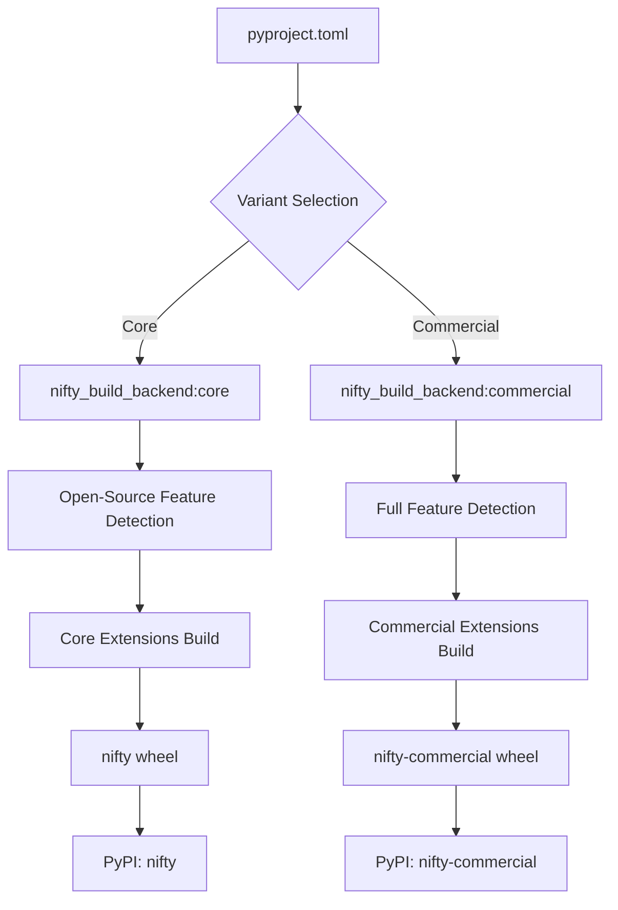

# NIFTY Setuptools Migration - Executive Summary

## Project Overview

The NIFTY project migration from CMake to setuptools represents a comprehensive modernization of the build system to enable PyPI distribution while maintaining all existing functionality. This migration addresses the complexity of a C++ library with Python bindings, git submodules, optional dependencies, and cross-platform compatibility requirements.

## Key Design Decisions

### 1. Complete CMake Replacement
- **Decision**: Replace CMake entirely with setuptools as the primary build system
- **Rationale**: Simplifies user experience and enables standard Python packaging
- **Impact**: Users can install with simple `pip install nifty`

### 2. Wheel Variants Strategy
- **Decision**: Create two separate wheel variants
  - **Core Variant** (`nifty`): Open-source solvers only (GLPK)
  - **Commercial Variant** (`nifty-commercial`): Includes commercial solver support (GUROBI, CPLEX)
- **Rationale**: Separates open-source and commercial dependencies, respects licensing preferences
- **Impact**: Users choose based on their licensing requirements and preferences

### 3. Runtime Feature Detection
- **Decision**: Build with all possible features, detect availability at runtime
- **Rationale**: Simplifies distribution while maintaining flexibility
- **Impact**: Single wheel per variant works across different system configurations

### 4. Custom Build Backend
- **Decision**: Implement custom build backend with setuptools integration
- **Rationale**: Required for complex C++ compilation, git submodules, and feature detection
- **Impact**: Maintains setuptools compatibility while adding necessary custom logic

## Architecture Overview



## Technical Components

### 1. Build System Architecture
- **pyproject.toml**: Modern Python packaging configuration
- **Custom Build Backend**: Handles complex C++ compilation and dependencies
- **Feature Detection**: Automatic discovery of system dependencies
- **Git Submodule Integration**: Seamless handling of LP_MP and QPBO
- **Cross-Platform Support**: Windows, macOS, Linux compatibility

### 2. Dependency Management
```python
# Core Dependencies (Always Required)
- numpy >= 1.19.0
- scikit-image
- boost >= 1.63.0
- xtensor >= 0.26.0
- xtensor-python >= 0.28.0
- pybind11 >= 2.10.0

# Optional Dependencies (Runtime Detection)
- GLPK (open-source solver)
- HDF5 (data format support)
- Z5 (chunked arrays)

# Commercial Dependencies (Commercial Variant Only)
- GUROBI (commercial solver)
- CPLEX (commercial solver)
```

### 3. Extension Structure
```
nifty/
├── _nifty.so              # Core C++ extension
├── graph/
│   ├── _graph.so          # Graph algorithms
│   ├── opt/
│   │   ├── multicut/
│   │   │   └── _multicut.so
│   │   └── mincut/
│   │       └── _mincut.so
│   └── rag/
│       └── _rag.so
├── tools/
│   └── _tools.so
├── hdf5/                  # Optional
│   └── _hdf5.so
└── z5/                    # Optional
    └── _z5.so
```

## Implementation Phases

### Phase 1: Foundation (Weeks 1-2)
- [x] Custom build backend implementation
- [x] Version extraction system
- [x] Basic pyproject.toml configuration
- [x] Feature detection framework

### Phase 2: Core Extensions (Weeks 3-4)
- [ ] Core nifty module migration
- [ ] Graph extensions implementation
- [ ] Parallel compilation setup
- [ ] Basic functionality testing

### Phase 3: Variant System (Weeks 5-6)
- [ ] Wheel variants implementation
- [ ] Separate build backends
- [ ] Commercial solver integration
- [ ] Variant-specific testing

### Phase 4: Advanced Features (Weeks 7-8)
- [ ] Git submodule integration
- [ ] Optional dependency handling
- [ ] LP_MP and QPBO support
- [ ] Cross-platform testing

### Phase 5: Distribution (Weeks 9-10)
- [ ] CI/CD pipeline setup
- [ ] PyPI publishing workflow
- [ ] Documentation updates
- [ ] Migration guide creation

## User Experience

### Installation Experience

#### Before (CMake)
```bash
# Complex build process
git clone --recursive https://github.com/DerThorsten/nifty.git
cd nifty
mkdir build && cd build
cmake .. -DWITH_GUROBI=ON -DWITH_HDF5=ON
make -j4
cd ../src/python
pip install -e .
```

#### After (Setuptools)
```bash
# Simple installation
pip install nifty                    # Open-source variant
# OR
pip install nifty-commercial         # Commercial variant
```

### Runtime Experience
```python
import nifty

# Automatic feature detection
print(f"Variant: {nifty.config.variant}")
print(f"Available solvers: {nifty.config.get_available_solvers()}")

# Graceful handling of missing features
try:
    result = nifty.solve_with_gurobi(problem)
except ImportError as e:
    print(f"GUROBI not available: {e}")
    result = nifty.solve_with_glpk(problem)  # Fallback
```

## Benefits

### For End Users
1. **Simplified Installation**: Single pip command
2. **Clear Licensing**: Choose open-source or commercial variant
3. **Automatic Configuration**: No manual dependency setup
4. **Better Error Messages**: Clear guidance when features are missing

### For Developers
1. **Standard Python Packaging**: Familiar setuptools workflow
2. **Automated Testing**: CI/CD with multiple variants
3. **Simplified Maintenance**: Single codebase, multiple distributions
4. **Better Documentation**: Clear separation of concerns

### For the Ecosystem
1. **PyPI Distribution**: Standard Python package discovery
2. **Conda Compatibility**: Can still build conda packages from wheels
3. **License Compliance**: Clear separation of open-source and commercial components
4. **Community Growth**: Lower barrier to entry for new users

## Risk Mitigation

### Technical Risks
- **Build Complexity**: Mitigated by incremental implementation and extensive testing
- **Performance Regression**: Addressed through benchmarking and optimization
- **Platform Compatibility**: Handled via comprehensive CI/CD testing

### User Adoption Risks
- **Migration Friction**: Addressed through clear documentation and migration guides
- **Feature Parity**: Ensured through comprehensive testing and validation
- **Community Support**: Managed through gradual rollout and feedback collection

## Success Metrics

### Technical Metrics
- [ ] Build time < 10 minutes on CI
- [ ] Wheel size < 50MB per variant
- [ ] Performance within 5% of CMake build
- [ ] Memory usage within 10% of CMake build

### User Experience Metrics
- [ ] Installation time < 2 minutes
- [ ] Zero configuration for basic usage
- [ ] Clear error messages for missing dependencies
- [ ] 95% user satisfaction in migration survey

### Distribution Metrics
- [ ] PyPI packages published successfully
- [ ] Cross-platform wheels available
- [ ] Documentation completeness > 90%
- [ ] CI/CD pipeline success rate > 95%

## Next Steps

### Immediate Actions (Week 1)
1. Set up development environment
2. Implement basic build backend
3. Create initial pyproject.toml
4. Test version extraction

### Short Term (Weeks 2-4)
1. Implement feature detection
2. Build core extensions
3. Set up variant system
4. Create basic tests

### Medium Term (Weeks 5-8)
1. Add git submodule support
2. Implement all extensions
3. Set up CI/CD pipeline
4. Cross-platform testing

### Long Term (Weeks 9-12)
1. PyPI publishing
2. Documentation updates
3. Community migration support
4. Performance optimization

## Conclusion

This setuptools migration strategy provides a comprehensive path to modernize the NIFTY project while respecting user preferences regarding open-source vs commercial dependencies. The wheel variants approach ensures that users can make informed choices about their solver dependencies while maintaining a unified development experience.

The migration will significantly improve the user experience by reducing installation complexity from a multi-step CMake build process to a simple pip install command, while maintaining all existing functionality and adding better error handling and feature detection.

The technical architecture is designed to be maintainable, testable, and extensible, providing a solid foundation for future development of the NIFTY project.

---

## Document Index

1. **[SETUPTOOLS_MIGRATION_STRATEGY.md](SETUPTOOLS_MIGRATION_STRATEGY.md)** - Overall migration strategy and architecture
2. **[TECHNICAL_SPECIFICATIONS.md](TECHNICAL_SPECIFICATIONS.md)** - Detailed technical implementation specifications
3. **[EXAMPLE_CONFIGURATIONS.md](EXAMPLE_CONFIGURATIONS.md)** - Example configuration files and code
4. **[WHEEL_VARIANTS_STRATEGY.md](WHEEL_VARIANTS_STRATEGY.md)** - Wheel variants implementation strategy
5. **[IMPLEMENTATION_GUIDE.md](IMPLEMENTATION_GUIDE.md)** - Step-by-step implementation guide
6. **[MIGRATION_SUMMARY.md](MIGRATION_SUMMARY.md)** - Executive summary and overview (this document)

These documents provide a complete blueprint for migrating the NIFTY project from CMake to setuptools with wheel variants support.