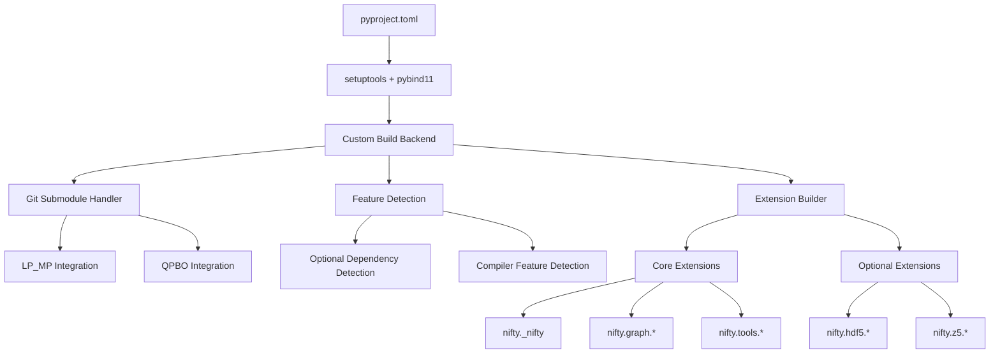

# NIFTY Setuptools Migration Strategy

## Executive Summary

This document outlines a comprehensive strategy for migrating the NIFTY project from CMake to setuptools as the primary build system. The migration will enable PyPI wheel distribution while maintaining all current functionality including complex C++ extensions, optional dependencies, and git submodules.

## Current Project Analysis

### Project Structure
- **Complex C++ library** with Python bindings via pybind11
- **Hierarchical Python modules**: 22+ C++ extensions organized in nested structure
- **Git submodules**: LP_MP and QPBO external libraries
- **Optional dependencies**: GUROBI, CPLEX, GLPK, HDF5, Z5, FastFilters
- **Version management**: C++ header-based versioning (nifty_config.hxx)
- **Multi-platform support**: Windows, macOS, Linux

### Current Dependencies
- **Core**: xtensor, xtensor-python, boost, pybind11, numpy
- **Optional**: GUROBI, CPLEX, GLPK, HDF5, Z5, FastFilters, LP_MP, QPBO
- **Build**: CMake, C++17 compiler, OpenMP (for LP_MP)

## 1. Overall Architecture

### Design Principles
1. **Complete CMake replacement** - setuptools becomes primary build system
2. **PyPI wheel distribution** - focus on standard Python packaging
3. **Runtime feature detection** - build with all features, detect at runtime
4. **Modular extension system** - maintain current hierarchical structure
5. **Cross-platform compatibility** - support Windows, macOS, Linux

### Architecture Overview



## 2. Build System Choice: Hybrid pyproject.toml + Custom Backend

### Rationale
- **pyproject.toml**: Modern Python packaging standard
- **Custom build backend**: Required for complex C++ compilation and git submodules
- **setuptools integration**: Leverage existing ecosystem while adding custom logic

### Implementation Strategy
```toml
[build-system]
requires = [
    "setuptools>=64",
    "pybind11>=2.10.0",
    "numpy>=1.19.0",
    "wheel"
]
build-backend = "nifty_build_backend"
```

## 3. Dependency Management Strategy

### Core Dependencies (Always Required)
```python
CORE_DEPENDENCIES = [
    "numpy>=1.19.0",
    "pybind11>=2.10.0",
    # Runtime dependencies
    "scikit-image",
]
```

### System Dependencies (Build-time Detection)
```python
SYSTEM_DEPENDENCIES = {
    "boost": {"min_version": "1.63.0", "required": True},
    "xtensor": {"min_version": "0.26.0", "required": True},
    "xtensor-python": {"min_version": "0.28.0", "required": True},
}
```

### Optional Dependencies (Runtime Detection)
```python
OPTIONAL_DEPENDENCIES = {
    "gurobi": {"compile_flag": "WITH_GUROBI", "runtime_check": True},
    "cplex": {"compile_flag": "WITH_CPLEX", "runtime_check": True},
    "glpk": {"compile_flag": "WITH_GLPK", "runtime_check": True},
    "hdf5": {"compile_flag": "WITH_HDF5", "runtime_check": True},
    "z5": {"compile_flag": "WITH_Z5", "runtime_check": True},
}
```

## 4. C++ Extension Compilation Strategy

### Extension Organization
```python
EXTENSIONS = {
    # Core module
    "nifty._nifty": {
        "sources": ["src/python/lib/nifty.cxx"],
        "dependencies": ["core"],
    },
    
    # Graph modules
    "nifty.graph._graph": {
        "sources": ["src/python/lib/graph/graph.cxx", "..."],
        "dependencies": ["core"],
    },
    
    # Optional modules
    "nifty.hdf5._hdf5": {
        "sources": ["src/python/lib/hdf5/hdf5.cxx"],
        "dependencies": ["core", "hdf5"],
        "optional": True,
    },
}
```

### Compilation Pipeline
1. **Dependency Detection**: Scan system for required/optional libraries
2. **Feature Flag Generation**: Create compile-time flags based on available features
3. **Source Collection**: Gather sources for each extension based on dependencies
4. **Parallel Compilation**: Build extensions in dependency order
5. **Runtime Configuration**: Generate runtime feature detection module

## 5. File Inclusion Strategy (MANIFEST.in)

### Include Strategy
```
# Source files
recursive-include src/python/lib *.cxx *.hxx *.hpp *.h
recursive-include src/python/module *.py

# Headers
recursive-include include *.hxx *.hpp *.h

# Git submodules (selected files only)
recursive-include externals/LP_MP/include *.hpp *.h
recursive-include externals/LP_MP/lib *.cpp *.hpp *.h
recursive-include externals/qpbo *.cpp *.h

# Configuration
include pyproject.toml
include MANIFEST.in
include README.md
include LICENSE

# Exclude build artifacts
global-exclude *.pyc
global-exclude __pycache__
global-exclude .git*
global-exclude CMakeLists.txt
global-exclude *.cmake
```

## 6. Version Management System

### Version Extraction Strategy
```python
def get_version():
    """Extract version from C++ header file."""
    version_file = Path("include/nifty/nifty_config.hxx")
    version_regex = r"#define NIFTY_VERSION_(MAJOR|MINOR|PATCH)\s+(\d+)"
    
    versions = {}
    with open(version_file) as f:
        for line in f:
            match = re.match(version_regex, line.strip())
            if match:
                versions[match.group(1).lower()] = int(match.group(2))
    
    return f"{versions['major']}.{versions['minor']}.{versions['patch']}"
```

### Version Synchronization
- **Single source of truth**: [`include/nifty/nifty_config.hxx`](include/nifty/nifty_config.hxx:4)
- **Automatic extraction**: Build system reads version at build time
- **Runtime access**: Version available via `nifty.__version__`

## 7. Feature Detection Mechanism

### Build-time Detection
```python
class FeatureDetector:
    def __init__(self):
        self.features = {}
    
    def detect_boost(self):
        """Detect Boost libraries."""
        # pkg-config, cmake, or manual detection
        pass
    
    def detect_optional_solver(self, solver_name):
        """Detect optional LP solvers."""
        # Environment variables, pkg-config, manual paths
        pass
    
    def generate_config_header(self):
        """Generate build configuration header."""
        config_content = []
        for feature, available in self.features.items():
            if available:
                config_content.append(f"#define WITH_{feature.upper()}")
        
        return "\n".join(config_content)
```

### Runtime Detection
```python
# In nifty/__init__.py
class Configuration:
    """Runtime feature detection."""
    
    @staticmethod
    def has_gurobi():
        try:
            import gurobipy
            return True
        except ImportError:
            return False
    
    @staticmethod
    def has_hdf5():
        try:
            import h5py
            return True
        except ImportError:
            return False
```

## 8. Git Submodule Handling

### Submodule Integration Strategy
```python
class SubmoduleHandler:
    def __init__(self):
        self.submodules = {
            "externals/LP_MP": {
                "url": "https://github.com/pawelswoboda/LP_MP.git",
                "required_files": ["include/", "lib/"],
                "compile_condition": "WITH_LP_MP"
            },
            "externals/qpbo": {
                "url": "https://github.com/DerThorsten/qpbo",
                "required_files": ["*.cpp", "*.h"],
                "compile_condition": "WITH_QPBO"
            }
        }
    
    def ensure_submodules(self):
        """Ensure git submodules are initialized and updated."""
        for path, config in self.submodules.items():
            if not Path(path).exists():
                subprocess.run(["git", "submodule", "update", "--init", path])
    
    def get_submodule_sources(self, submodule_path):
        """Get source files from submodule."""
        # Return list of source files to compile
        pass
```

## 9. Final Package Structure

### Installed Package Layout
```
nifty/
├── __init__.py                 # Main module with Timer, Configuration
├── _nifty.cpython-*.so        # Core C++ extension
├── graph/
│   ├── __init__.py
│   ├── _graph.cpython-*.so    # Graph algorithms
│   ├── agglo/
│   │   ├── __init__.py
│   │   └── _agglo.cpython-*.so
│   ├── opt/
│   │   ├── __init__.py
│   │   ├── multicut/
│   │   │   ├── __init__.py
│   │   │   └── _multicut.cpython-*.so
│   │   └── ...
│   └── rag/
│       ├── __init__.py
│       └── _rag.cpython-*.so
├── tools/
│   ├── __init__.py
│   └── _tools.cpython-*.so
├── hdf5/                      # Optional module
│   ├── __init__.py
│   └── _hdf5.cpython-*.so
└── z5/                        # Optional module
    ├── __init__.py
    └── _z5.cpython-*.so
```

### Module Import Strategy
```python
# In nifty/hdf5/__init__.py
try:
    from ._hdf5 import *
    HDF5_AVAILABLE = True
except ImportError as e:
    HDF5_AVAILABLE = False
    
    def __getattr__(name):
        raise ImportError(f"HDF5 support not available: {e}")
```

## 10. Implementation Roadmap

### Phase 1: Foundation (Weeks 1-2)
1. Create custom build backend
2. Implement version extraction
3. Set up basic pyproject.toml
4. Create feature detection framework

### Phase 2: Core Extensions (Weeks 3-4)
1. Migrate core nifty module
2. Implement graph extensions
3. Set up parallel compilation
4. Test basic functionality

### Phase 3: Optional Features (Weeks 5-6)
1. Integrate git submodules
2. Implement optional dependency detection
3. Add HDF5, Z5 support
4. Test feature detection

### Phase 4: Advanced Features (Weeks 7-8)
1. Add LP solver support
2. Implement LP_MP integration
3. Add QPBO support
4. Comprehensive testing

### Phase 5: Distribution (Weeks 9-10)
1. Create wheel building pipeline
2. Test cross-platform builds
3. Set up CI/CD for PyPI
4. Documentation updates

## Technical Challenges and Solutions

### Challenge 1: Complex Extension Dependencies
**Solution**: Dependency graph resolution with topological sorting

### Challenge 2: Git Submodule Integration
**Solution**: Custom build backend with submodule initialization

### Challenge 3: Optional Feature Compilation
**Solution**: Runtime detection with graceful degradation

### Challenge 4: Cross-platform Compatibility
**Solution**: Platform-specific compiler flags and library detection

### Challenge 5: Large Codebase Migration
**Solution**: Incremental migration with parallel CMake support during transition

## Success Criteria

1. **Functional Parity**: All current features work identically
2. **PyPI Distribution**: Successful wheel uploads and installations
3. **Cross-platform**: Windows, macOS, Linux support
4. **Performance**: No significant performance regression
5. **Maintainability**: Simplified build process for developers

## Risk Mitigation

1. **Backup Strategy**: Keep CMake system until full validation
2. **Incremental Testing**: Test each component independently
3. **Community Feedback**: Early testing with key users
4. **Rollback Plan**: Clear rollback procedures if issues arise

This migration strategy provides a comprehensive path from the current CMake-based system to a modern setuptools-based build system suitable for PyPI distribution while maintaining all existing functionality.